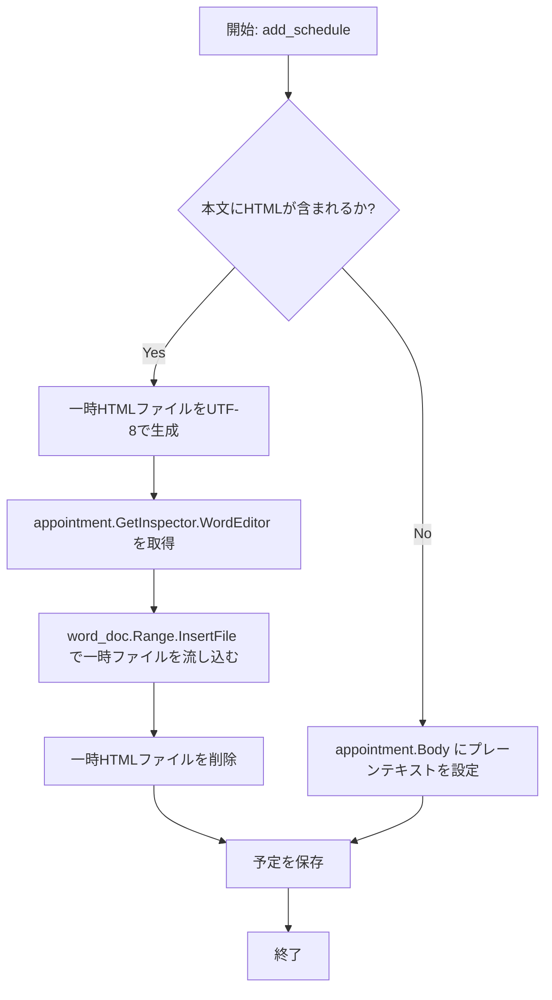

# Outlook宛先作成アプリ - HTML本文の貼り付け・登録改善 設計仕様書

## 概要

Outlookの予定表（特にクラシックOutlook）にHTML/リッチテキストの本文をきれいに登録し、かつアプリ内での貼り付け動作を軽量化・安定化させるための設計仕様書です。

### 解決する課題
1. **クラシックOutlookの予定（AppointmentItem）のHTML制限**
   Outlook COMの `AppointmentItem` には `HTMLBody` プロパティが公式に存在しません。そのため、従来のコードで設定を試みるとCOMエラーとなり、プレーンテキスト用の `Body` プロパティに生のHTML文字列が設定されてしまっていました。これにより、Outlook上で生HTMLタグがそのままテキストとして露出していました。
2. **Word HTMLによるアプリエディタおよびOutlook側の表示崩れ**
   OutlookからコピーしたHTMLは、Word独自の巨大なスタイルや独自タグ（`<o:p>` など）を含んでいます。ブラウザの `contentEditable` がこれを処理する際、中途半端に構造が壊れてしまい、文字が極端に縮小されるなどの崩れを引き起こします。

---

## 1. フロントエンド：HTML貼り付けサニタイザー

フロントエンドでは、エディタ（`HtmlEditor`）でのペースト（貼り付け）時に、クリップボード内の `text/html` を検知して自動的に不要なOffice特有のゴミ情報をサニタイズ（クリーンアップ）します。

### サニタイズの要件
1. **不要なタグの完全除去**
   - `<style>`（スタイル定義）、`<meta>`、`<link>`、`<title>`、`<xml>`、`<script>`、`<noscript>` などを除去。
2. **Office独自の名前空間タグのクリーンアップ**
   - `<o:p>` や `<w:...>` などの名前空間付きタグは、タグ自体を除去しつつ、内部のテキストや子要素を親要素の直下に移動させる。
3. **不要な属性の除去**
   - `class`, `id` 属性はすべて除去する。
   - `style` 属性は部分的に必要なもの（文字色、背景色、太字、斜体、下線、配置）以外、Word独自の余白（`margin`, `padding`）やフォント指定（`font-family`）、行高さ（`line-height`）、`mso-` プレフィックスのスタイルをすべて除去する。
4. **許可する属性**
   - `href`（ハイパーリンク）、`src`（画像）、`alt`（画像代替テキスト）、`colspan`, `rowspan`（テーブル）、`border`, `align`, `target` など。

---

## 2. バックエンド：WordEditorによるHTML予定登録

バックエンドでは、予定（`AppointmentItem`）オブジェクトにHTML本文を正確に設定するため、Outlookが標準で備えるWord編集エンジン（WordEditor）のファイル挿入機能（`InsertFile`）を利用します。

### 登録フロー

### WordEditorインポートの仕様
- 一時ファイル（例: `temp_outlook_body.html`）を `utf-8` エンコーディングで作成。
- 作成した一時ファイルを `word_doc.Range().InsertFile(temp_filepath)` で読み込ませる。これにより、Wordの強力なHTMLインポートエンジンが自動で動き、クラシックOutlookの予定本文にパーフェクトにリッチテキストが再現されます。
- 処理終了後、一時ファイルは速やかに削除します。
