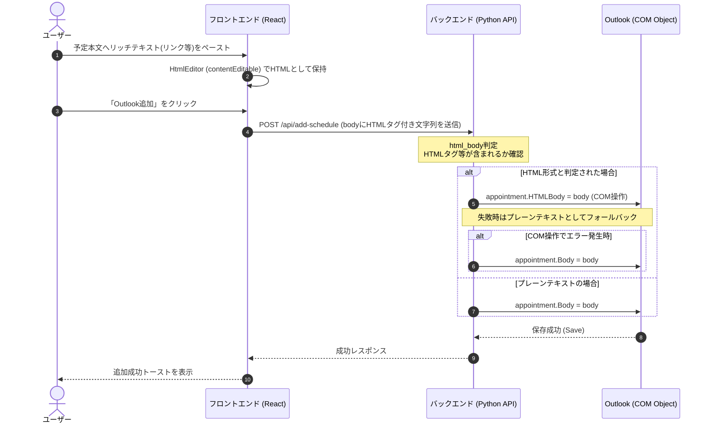

# 予定本文HTML貼り付け・Outlook連携仕様書

## 概要
予定（Outlook AppointmentItem）の本文において、プレーンテキストだけでなくHTML形式の貼り付け（リッチテキスト、リンクを含む）をサポートし、そのリンク付きの情報を正しくOutlook予定表へ反映することを目的とします。

---

## 処理フロー

---

## 詳細設計

### 1. フロントエンド (`HtmlEditor`) の設計
Reactにおける `contenteditable` は、制御コンポーネントとして単純に `value` をStateと同期させると、キー入力ごとに `innerHTML` を更新してしまい、日本語入力（IME）中にカーソル（キャレット）が飛ぶ問題が発生します。
これを回避するため、以下の設計を採用します。

- **非制御的な同期**: `ref` を用い、外部からのState変更（予定解析の実行など）があったときのみ `innerHTML` を書き換えます。
- **入力確定時の反映**: ユーザーによるタイピング中にはStateへの書き戻しを抑え、`onBlur`（フォーカスアウト時）に `innerHTML` の値を `onChange` を通じてStateに反映します。
- **リッチテキスト維持**: ブラウザ標準の `contenteditable` の貼り付け挙動を利用し、ペーストされたリンク情報やフォント修飾をHTML形式で保持します。

### 2. バックエンドのHTMLBody判定
バックエンド（`server.py`）にて、受け取った `body` がHTMLであるかどうかを以下のルールで判定します。

- **判定条件**: 以下のいずれかを満たす場合
  - 行頭または文字列中に `<html>` が含まれる
  - リンクタグ `<a ` が含まれる
  - その他 `<p` `<div` `<span` などの一般的なHTMLタグで始まる・含まれる
- **保存ロジック**:
  HTML形式と判定された場合、`appointment.HTMLBody` プロパティへ設定します。これにより、Outlook上でリンク付きのリッチテキストとしてレンダリングされます。
  
- **エラーフォールバック**:
  一部のOutlookバージョンや環境において `HTMLBody` への代入が失敗する、あるいは動作しない場合に備え、`try-except` で例外を捕捉し、従来の `appointment.Body = body` に自動でフォールバックさせます。プレーンテキストとしてそのまま保存されるため、処理が中断することはありません。
